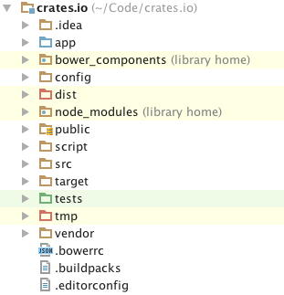

Features
===============================================================================

Project Discovery
-------------------------------------------------------------------------------

Ember.js projects are automatically discovered when imported via 
`File → New → Project from Existing Sources...`. The importer will look for an
`app/app.js` file and will flag the project as an Ember.js project if the file
exists.

The language level for Ember.js projects is automatically set to ES6 and
JSHint support is enabled using the `.jshintrc` file.

Marking special folders
-------------------------------------------------------------------------------

The importer will mark certain folders like this:

- `app` as `Sources Root`
- `public` as `Resources Root`
- `tests`, `tests/unit` and `tests/integration` as `Tests Root`
- `dist` and `tmp` as `Excluded`

This will cause the "Packages" view to look like this:

Quick Navigation
-------------------------------------------------------------------------------

The plugin is indexing all typical components in the `app` folder and is
providing them for quick access via the `Navigate → Class...` action. Currently
supported are:

- Adapters 
- Components
- Controllers
- Helpers
- Models
- Routes
- Serializers
- Services
- Transforms

The indexer will transform file paths into class names by capitalizing the
path parts and appending a type suffix

Example: `app/routes/pets/index.js` will be indexed as `PetsIndexRoute`

  

-------------------------------------------------------------------------------

Most screenshots in this document are taking from an import of the 
[crates.io](https://github.com/rust-lang/crates.io) project.
